# 📊📈 Finance Tracker
This project is a **Google Sheets template** designed to help small businesses easily track their **daily sales, purchases, expenses**, and monitor overall performance — without the need for any technical setup or accounting background.

It offers a **simple, structured workflow** that gives business owners quick insights into their financial health, helping them make better day-to-day decisions.

---

## 💡 Why I Built This

I created this template with **small business owners** in mind, particularly those who might not have the budget for expensive accounting software or the time to maintain and support it.

The goal is to offer an **affordable and easy-to-use solution** that streamlines the process of tracking finances, without the need for technical expertise or ongoing costs.

---

## 📑 Included Tabs

This template includes the following tabs to help you track your business’s performance effectively:

1. **SALES DASHBOARD**
   
   - Displays **daily revenue**, overall **average per day**, **max day**, and **min day**.
   - Shows **weekly revenue**, **average per day of the week**, and the **% difference** with the current week and average per day.
   - Similar comparisons for **monthly revenue**.
   - A feature to compare sales between two periods (the user can choose the start and end dates).
   - Includes a **pie chart** to visualize the percentage of **card/cash payments**.
  

  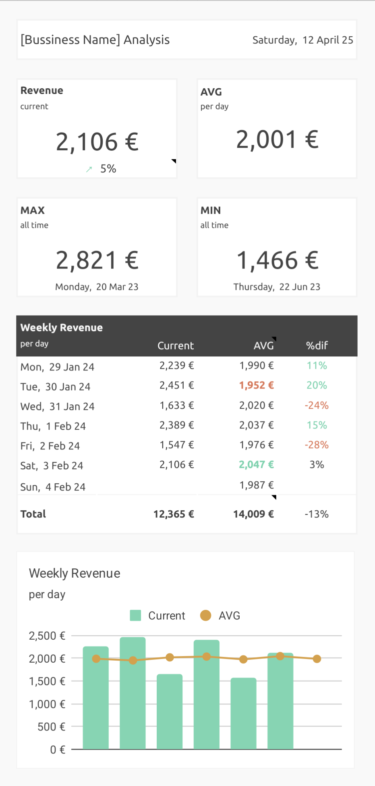
  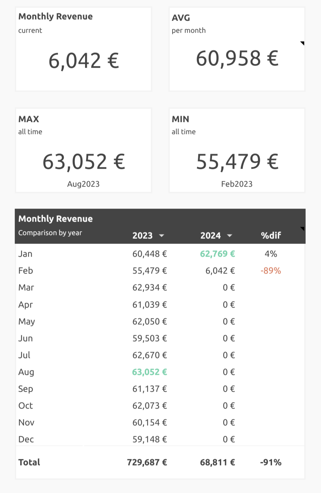
  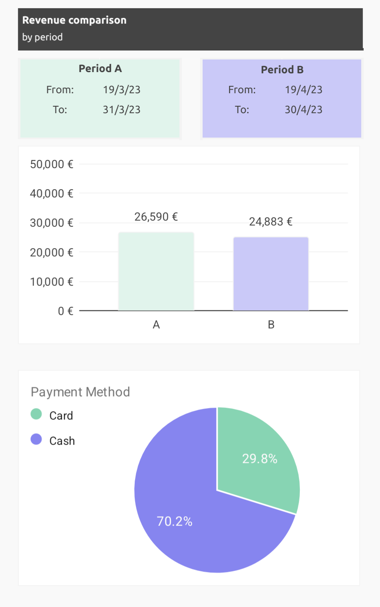

2. **PURCHASES DASHBOARD**
   
   - Displays the **Top 5 suppliers** and **Bottom 5 suppliers** based on purchases.
   - A **pie chart** showing the percentage of **purchases per category**.
   - A **chart** that tracks total purchases by month, with an **average purchases line** for comparison.

  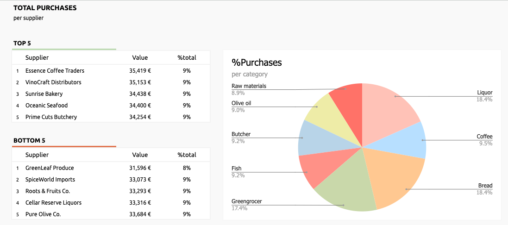
  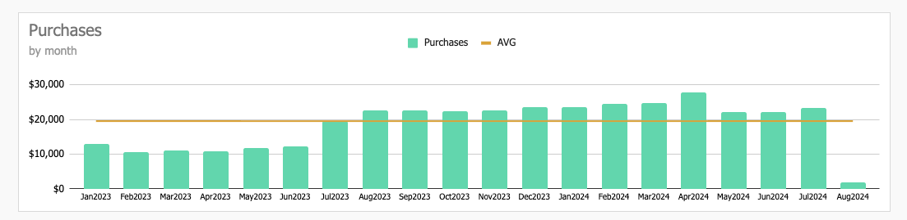

3. **OVERVIEW**
   
   - Gathers all data into one single table by **month**, calculating:
      - Total **Sales**, **Expenses**, and **Running Totals**.
      - **Profit/Loss** for each month and overall total.
   

  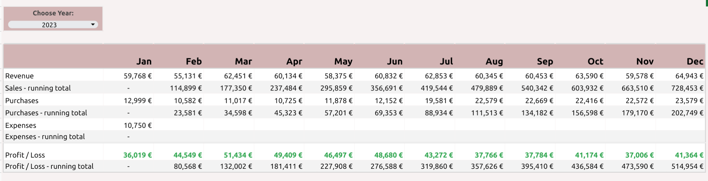

4. **SALES**
   
   - A place for users to log their **daily revenue totals**.
   - Helps track the flow of money from the **cash registers** to ensure accuracy and correctness.
  

  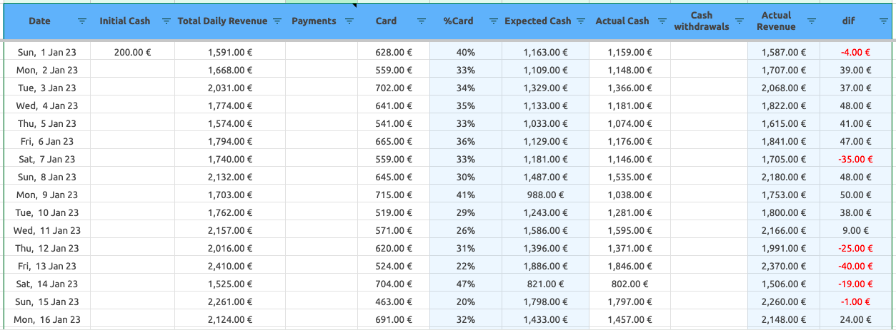

5. **PURCHASES**
   
   - Users log the **date and cost of purchases**, as well as the **supplier's name**.
   - Categorizes the supplier based on the information in the **Settings** tab.
   - Tracks the status of payments to suppliers: whether the supplier has been paid in full, not paid, or paid partially (with outstanding balances visible in the **Balance** tab).

  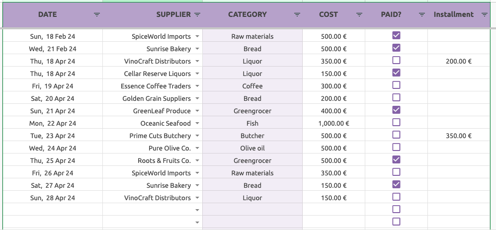

6. **EXPENSES**
   
   - Functions similarly to the **Purchases** tab but for non-purchase business expenses like **utilities, salaries, etc.**.
   - Logs expenses and categorizes them for easy tracking and analysis.

  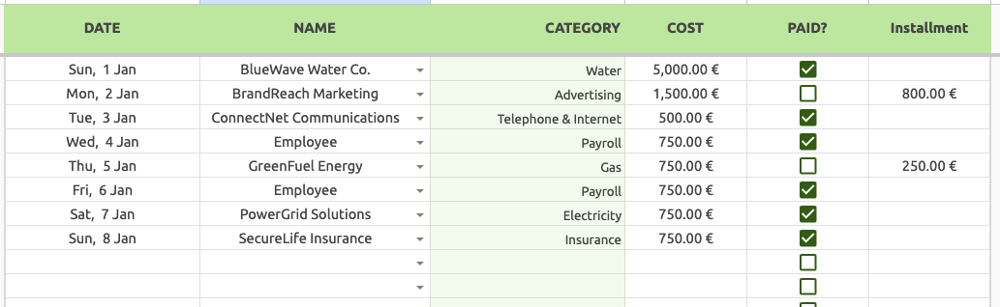

7. **BALANCE**
   
   - A dashboard that shows the amounts owed to each supplier and any unpaid expenses.
   - Provides an overview of **outstanding debts** and expenses, helping you track the financial health of your business.

  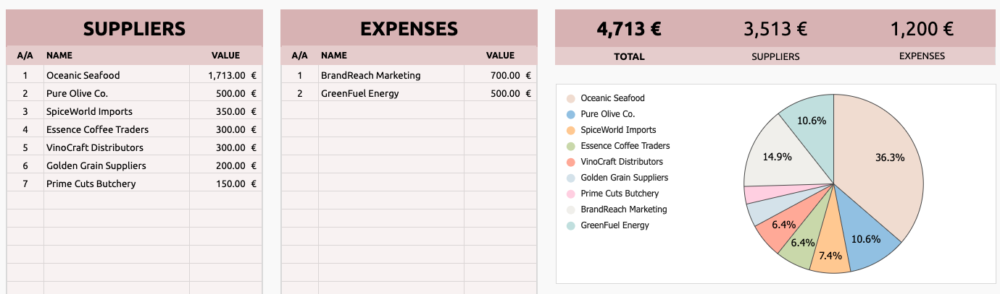

8. **SETTINGS**
   
   - A simple way to save and manage **suppliers**, **categories for purchases**, and **expense categories**.
   - These settings are then used to automatically fill in the relevant categories in the **Purchases** and **Expenses** tabs.

  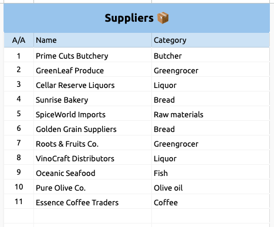
  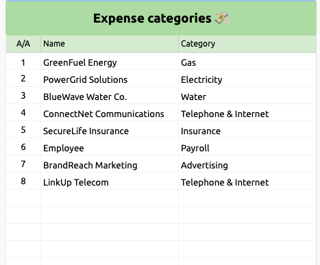

## ⚠️ Important Note

Please note that all numbers and names shown throughout the template are **randomly generated** and **do not represent real data**.

---

## 📬 Get in Touch

If you're interested or have any questions, feel free to reach out!

📧 Email: [k.p.kesidis@gmail.com](mailto:k.p.kesidis@gmail.com)

